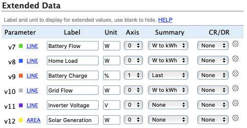

# Powerwall to PVOutput Uploader
This is a TypeScript/PostgreSQL version of [Powerwall2PVOutput](https://github.com/ekul135/Powerwall2PVOutput/), written partially for learning and also because I found the SQLite file from that repository kept getting corrupted.

It sends [extended data](https://pvoutput.org/help.html#extendeddata) to PVOutput, and so requires an [active donation](https://pvoutput.org/donate.jsp). To set up the extended data, use the following setup on your Edit System page on PVOutput:



The application requires a file called `config.json` with the following contents:

```
{
    "database": {
        "host": "localhost",
        "port": 5432,
        "user": "username",
        "password": "password",
        "database": "pvoutput"
    },
    "timezone": "Australia/Sydney",
    "powerwallUrl": "https://powerwall",
    "pvoApiKey": "abc123",
    "pvoSystemId": "12345"
}
```

* The `timezone` option can be omitted if the script is running natively on your machine rather than inside a Docker container (inside a Docker container, the timezone is always UTC).
* The `pvoApiKey` can be generated in [account settings](https://pvoutput.org/account.jsp) at PVOutput, and the `pvoSystemId` is listed under Registered Systems on the same page.
