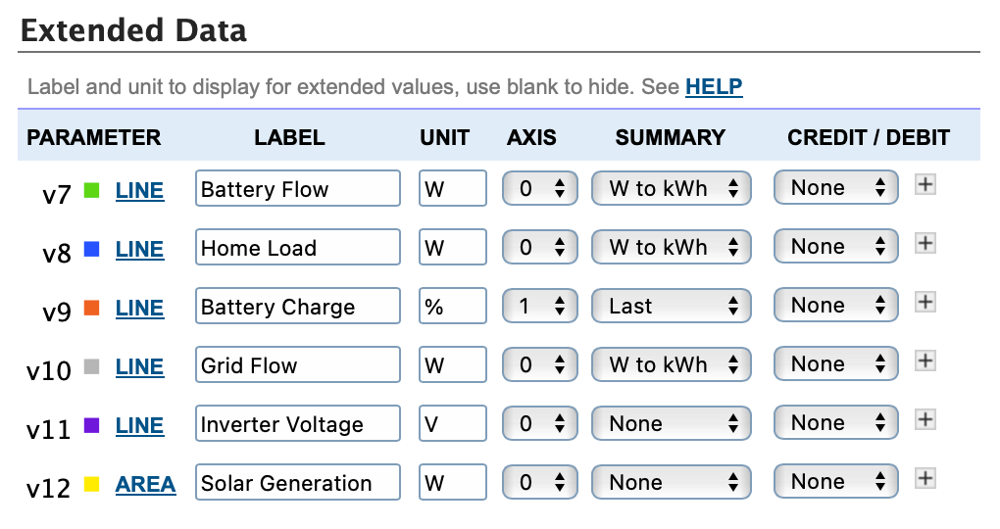

# Overview
This is a TypeScript/PostgreSQL version of [Powerwall2PVOutput](https://github.com/ekul135/Powerwall2PVOutput/), written partially for learning and also because I found the SQLite file from that repository kept getting corrupted.

# Configuration
Copy the example configuration file `.env.example` in the root level of the repository to `.env` and at a minimum fill out all the uncommented variables.

## Required settings
* `POSTGRES_PASSWORD` — The standard Docker setup for powerwall-to-pvoutput-uploader includes its own PostgreSQL Docker container and volume to save data to, so the only _required_ environment variable is `POSTGRES_PASSWORD`.
    * If you're running directly on your machine without Docker, you'll need to configure the other `POSTGRES_` variables that are commented out.
* `POWERWALL_URL` — The local URL of your Powerwall.
    * ⚠️ **Important note:** This _must_ be an `https://` URL and not an `http://` one.
    * Additionally, according to [this document](https://github.com/vloschiavo/powerwall2?tab=readme-ov-file#a-note-about-https-and-ssl-certificates) the Powerwall will only respond if you're accessing it via either direct IP address, or via `https://powerwall`, `https://powerpack`, or `https://teg`, without any domain component.
* `POWERWALL_EMAIL` and `POWERWALL_PASSWORD` — Accessing the Powerwall 2's API locally since firmware version 20.49.0 requires a username and password. If you haven't set up a username and password on the Powerwall 2 yet, [follow the instructions on Tesla's site](https://www.tesla.com/support/energy/powerwall/own/monitoring-from-home-network) to configure them.
* `TIMEZONE` — If you're using the standard Docker setup, be sure to set this variable as inside a Docker container, the timezone is always UTC which will throw off the times being sent to PVOutput. (This isn't _strictly_ required, but highly recommended.)
* `PVOUTPUT_API_KEY` and `PVOUTPUT_SYSTEM_ID` — The API key can be generated in [account settings](https://pvoutput.org/account.jsp) at PVOutput, and the system ID is listed under Registered Systems on the same page.

To send [extended data](https://pvoutput.org/help.html#extendeddata) to PVOutput, you need a PVOutput account with an [active donation](https://pvoutput.org/donate.jsp) and the `PVOUTPUT_SEND_EXTENDED_DATA` environment variable set to `true` in `.env`. To set up the extended data, use the following setup on your Edit System page on PVOutput:

<picture>
    <source media="(prefers-color-scheme: dark)" srcset="images/extended-data-dark.png">
    <source media="(prefers-color-scheme: light)" srcset="images/extended-data-light.png">
    
</picture>

<details>
<summary>Text description of Extended Data settings</summary>

| Parameter    | Label            | Unit | Axis | Summary  |
|--------------|------------------|------|------|----------|
| **v7** Line  | Battery Flow     | W    | 0    | W to kWh |
| **v8** Line  | Home Load        | W    | 0    | W to kWh |
| **v9** Line  | Battery Charge   | %    | 1    | Last     |
| **v10** Line | Grid Flow        | W    | 0    | W to kWh |
| **v11** Line | Inverter Voltage | V    | 0    | None     |
| **v12** Area | Solar Generation | W    | 0    | None     |
</details>

## Optional settings
* `DEBUG` — Set this to enable full debug logging of everything that's going on
* `DISABLE_PVOUTPUT_UPLOAD` — Set this to have the application do everything except actually send data to PVOutput (useful for local development, or if you don't care about PVOutput at all and just want to have the data from the Powerwall accessible via MQTT as described below)

## Publishing to MQTT
* `MQTT_HOST`, `MQTT_PORT`, and `MQTT_TOPIC` — Set these variables to have powerwall-to-pvoutput publish the data it receives from the Powerwall to the specified MQTT broker and topic.
    * `MQTT_PORT` is optional and defaults to 1883 if not specified

The data format that will be send to the given MQTT topic is the same as what's sent to PVOutput:

```json
{
    "timestamp": <number>,
    "solar_generation": <number>,
    "solar_voltage": <number>,
    "home_usage": <number>,
    "home_voltage": <number>,
    "grid_flow": <number>,
    "battery_flow": <number>,
    "battery_charge_percentage": <number>
}
```

# Running
* To run it in a Docker container in a production-like configuration, start it with `docker compose up --build -d`. If the image doesn't exist, it will be built, and if there have been any new changes pulled from this repository, it will be rebuilt.
* To run it locally on your machine with Node.js without Docker involved, compile it with `npm run build`, prepare the database with `npm run db:migrate` and start it with `npm start`, then use something like [PM2](https://pm2.keymetrics.io) or [Forever](https://www.npmjs.com/package/forever) to keep it up.
* To run it in a development-like environment for poking around, use `./bin/start-dev.sh` to load the code up in a Docker container. It uses `nodemon` to automatically reload on file changes.
